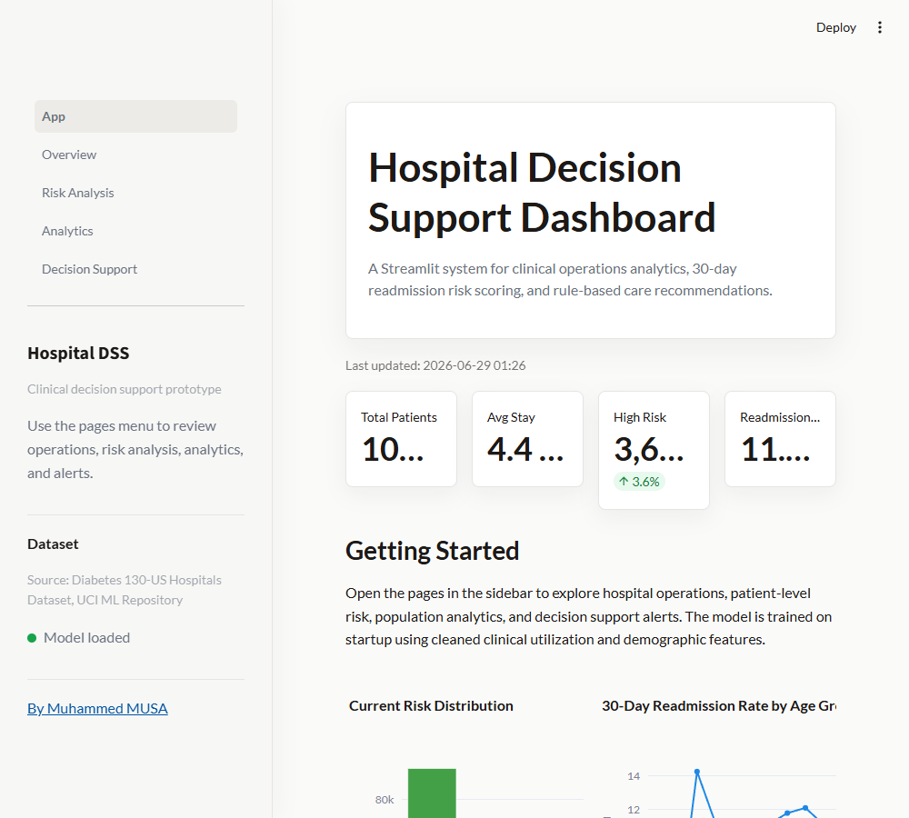

# Hospital Decision Support Dashboard




## Description

Hospital Decision Support Dashboard is a professional multi-page Streamlit application for exploring the Diabetes 130-US Hospitals dataset, training a readmission risk model, and surfacing decision support alerts for high-risk patients.

The project is designed as a Biomedical Engineering portfolio piece that demonstrates real clinical data processing, machine learning, healthcare operations analytics, and SaMD-style decision support thinking.

## Installation

```bash
pip install -r requirements.txt
streamlit run app.py
```

## Project Structure

```text
hospital_dashboard/
  app.py
  data/
    diabetic_data.csv
  src/
    data_loader.py
    preprocessor.py
    model.py
    kpi.py
    alerts.py
    pipeline.py
    styles.py
  pages/
    1_Overview.py
    2_Risk_Analysis.py
    3_Analytics.py
    4_Decision_Support.py
  assets/
    style.css
  requirements.txt
  README.md
```

## Features

- Cached data loading and cleaning for the Diabetes 130-US Hospitals CSV.
- Feature engineering with gender encoding and StandardScaler normalization.
- Random Forest readmission risk model with accuracy, precision, recall, and F1 metrics.
- Patient-level risk scores and High, Medium, and Low risk categories.
- KPI overview for total patients, length of stay, readmission rate, and high-risk patients.
- Interactive filters for risk category, age range, and hospital stay.
- Demographic, clinical, and readmission analytics with Plotly charts.
- Rule-based alerts and patient-level intervention recommendations.

## Dataset Source

This application uses the Diabetes 130-US Hospitals for Years 1999-2008 dataset from the UCI Machine Learning Repository.

Citation: Clore, J., Cios, K., DeShazo, J., and Strack, B. Diabetes 130-US hospitals for years 1999-2008. UCI Machine Learning Repository.

## Research Context

The system demonstrates concepts relevant to Biomedical Engineering, clinical decision support systems, hospital operations analytics, and Software as a Medical Device research workflows. It is intentionally transparent: model metrics are visible, alert rules are simple to inspect, and recommendations are framed as support rather than clinical authority.

## Disclaimer

This system is a prototype for research purposes.
